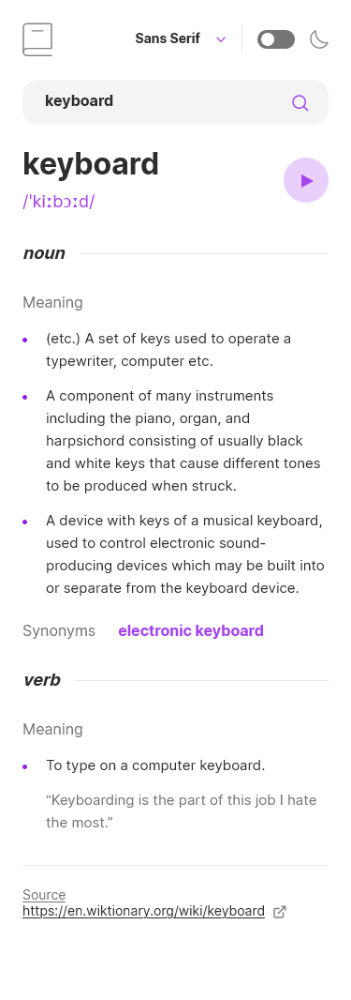
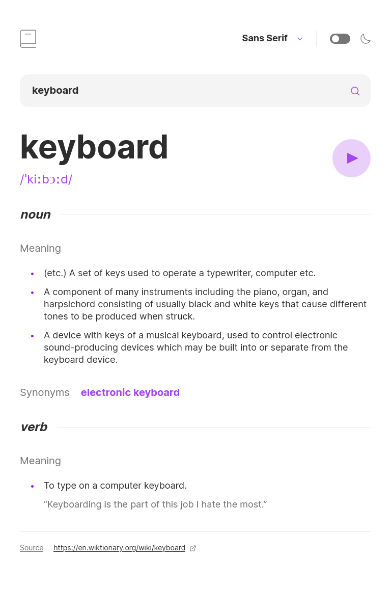
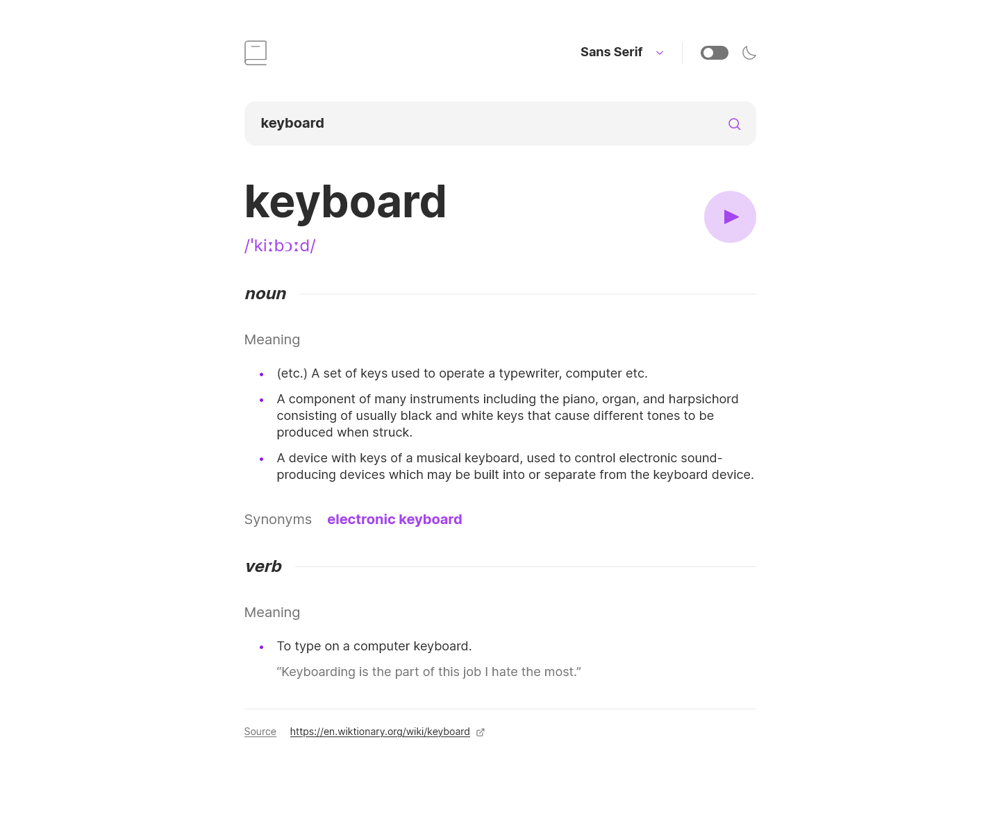

# Frontend Mentor - Dictionary web app solution

This is a solution to the [Dictionary web app challenge on Frontend Mentor](https://www.frontendmentor.io/challenges/dictionary-web-app-h5wwnyuKFL). Frontend Mentor challenges help you improve your coding skills by building realistic projects. 

## Table of contents

- [Overview](#overview)
  - [The challenge](#the-challenge)
  - [Screenshot](#screenshot)
  - [Links](#links)
- [My process](#my-process)
  - [Built with](#built-with)
- [Author](#author)

## Overview

### The challenge

Users should be able to:

- [x] Search for words using the input field
- [x] See the Free Dictionary API's response for the searched word
- [x] See a form validation message when trying to submit a blank form
- [x] Play the audio file for a word when it's available
- [x] Switch between serif, sans serif, and monospace fonts
- [x] Switch between light and dark themes
- [x] View the optimal layout for the interface depending on their device's screen size
- [x] See hover and focus states for all interactive elements on the page
- [x] **Bonus**: Have the correct color scheme chosen for them based on their computer preferences. _Hint_: Research `prefers-color-scheme` in CSS.

### Screenshot

#### Result Mobile

#### Result Tablets

#### Result Desktops

### Links

- Solution URL: [Add solution URL here](https://your-solution-url.com)
- Live Site URL: [Add live site URL here](https://your-live-site-url.com)

## My process

### Built with

- Semantic HTML5 markup
- CSS(Flexbox, Grid, Bem Metodolody CSS Architecture)
- Mobile-first workflow, Responsive Web Design(RWD)
- WebAcessibility with arias attributers, and roles
- Typescript
- FETCH API
- [Free Dictionary API](https://dictionaryapi.dev/) - API
- [React](https://reactjs.org/) - JS library
  - Hooks React
  - Context API

## Getting Started with Create React App

This project was bootstrapped with [Create React App](https://github.com/facebook/create-react-app).

### Available Scripts

In the project directory, you can run:

#### `npm start`

Runs the app in the development mode.\
Open [http://localhost:3000](http://localhost:3000) to view it in the browser.

The page will reload if you make edits.\
You will also see any lint errors in the console.

#### `npm test`

Launches the test runner in the interactive watch mode.\
See the section about [running tests](https://facebook.github.io/create-react-app/docs/running-tests) for more information.

#### `npm run build`

Builds the app for production to the `build` folder.\
It correctly bundles React in production mode and optimizes the build for the best performance.

The build is minified and the filenames include the hashes.\
Your app is ready to be deployed!

See the section about [deployment](https://facebook.github.io/create-react-app/docs/deployment) for more information.

## Author

- Website - [Portefólio Samuel Amaro](https://samuel-amaro.github.io/portfolio-web/)
- Frontend Mentor - [@Samuel-Amaro](https://www.frontendmentor.io/profile/Samuel-Amaro)

